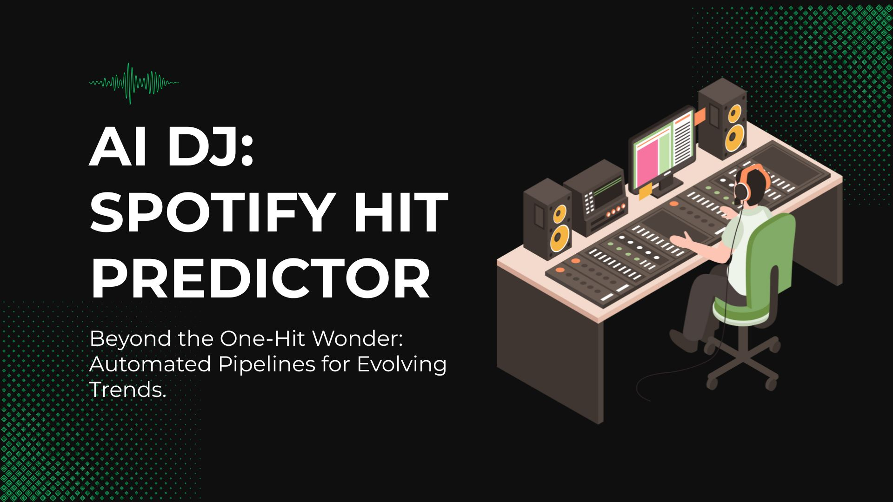

# 🎧 AI DJ: Spotify Hit Predictor

<p align="center">
  
</p>

**Course Project: INFO9023 - Machine Learning Systems Design** **Sprint 1: Project Organization** 

## 📌 Project Overview
The **AI DJ** is an end-to-end MLOps system designed to help record labels predict if a song will be a "Hit" or a "Flop" before release. While many ML projects stay as prototypes, this system is built with a focus on a production-ready **Automated Pipeline** (CI/CD/CT) to handle the fast-paced nature of music trends.

### 🎯 Value Proposition
* **Problem**: Music trends change rapidly, leading to high "technical debt" if models are not continuously updated.
* **Solution**: A predictive service that assesses song features (Danceability, Energy, Tempo) and triggers retraining based on **Seasonal Drift**.

## 🏗 System Architecture & Technical Stack
This project implements the "Hidden Technical Debt" concept by focusing on the 90% of engineering that surrounds the ML code.

* **Containerization**: The application is packaged using **Docker** to ensure consistency from development to production.
* **Orchestration**: Managed via **GitHub Actions** for CI/CD and **DVC** for data version control.
* **Model Serving**: Served as a **REST API** using **FastAPI** (deployed on Google Cloud Run) for real-time inference.
* **Monitoring**: Integrated performance tracking to detect data and concept drift.

## 📁 Project Structure
Following the course's mandatory documentation standards:
``` 
info9023-ai-dj/
├── .github/workflows/       # CI/CD/CT (GitHub Actions)
│   ├── ci.yaml              # Runs Python & Next.js tests on PRs
│   ├── deploy-api.yaml      # Deploys FastAPI to Cloud Run
│   └── deploy-web.yaml      # Deploys Next.js to Cloud Run/Vercel
├── data/                    # Data folder (tracked by DVC)
│   ├── raw/                 # Original Kaggle CSV (DVC pointer)
│   └── processed/           # Transformed data for training
├── docs/                    # Course Documentation
│   ├── DEPLOYMENT.md        # Steps to build Docker images
│   ├── MONITORING.md        # Drift detection logic (Summer/Winter)
│   └── API_SPEC.md          # JSON request/response examples
├── src/
│   ├── api/                 # BACKEND (FastAPI)
│   │   ├── main.py          # API Routes & Spotify logic
│   │   ├── schemas.py       # Pydantic models (Data Validation)
│   │   ├── model_loader.py  # Loads the .pkl or MLflow model
│   │   └── utils.py         # spotipy client wrapper
│   ├── web/                 # FRONTEND (Next.js)
│   │   ├── components/      # Radar charts, Hit gauges
│   │   ├── pages/           # Search & Prediction views
│   │   └── lib/             # API client to talk to FastAPI
│   ├── training/            # ML PIPELINE
│   │   ├── train.py         # Training script (XGBoost/LightGBM)
│   │   └── evaluate.py      # Logs metrics to MLflow
│   └── monitoring/          # DRIFT DETECTION
│       └── drift_service.py # Checks for "Musical Seasonal Drift"
├── tests/                   # Quality Assurance
│ 
├── Dockerfile.api           # Container for the Backend
├── Dockerfile.web           # Container for the Next.js App
├── dvc.yaml                 # DVC Pipeline (Data -> Train -> Eval)
├── requirements.txt         # Python dependencies
├── package.json             # Next.js dependencies
├── README.md                # Project landing page
├── .gitignore               # Git ignore rules 
└── utiles                   # Additional config files

```

## 🚀 Development Workflow
We follow the Gitflow principles as required by the course:

Work on feature branches based on the develop branch.

Create Pull Requests (PR) from develop → main for each Milestone release.

Ensure all code is well-documented; points are deducted if the staff cannot easily verify functionality.

## 👥 The Team
Student : Charlotte Michon Charlotte.michon@student.uliege.be

Student : Antoine Paulis Antoine.paulis@student.uliege.be

Student : Mohamed-Khalil Ankri Mohamed-khalil.ankri@student.uliege.be


## 📊 Dataset: Spotify Tracks Data Dictionary

This dataset consists of ~114,000 Spotify tracks across 125 genres. Below is the technical schema used for our training and inference pipelines.

### 🆔 Metadata & Identifiers
* **track_id**: Unique Spotify ID for the track.
* **artists**: Names of performing artists (separated by `;`).
* **album_name**: Name of the album containing the track.
* **track_name**: Name of the track.
* **track_genre**: The genre category (used for drift analysis).

### 🎯 Target Variable
* **popularity (0-100)**: Calculated by Spotify's algorithm based on total plays and recency. 
    * *MLOps Note:* We transform this into a binary **Hit (1)** or **Flop (0)** for classification.

### 🎸 Audio Features (Model Inputs)
To ensure data integrity, our **FastAPI** validation layer (Pydantic) enforces the following constraints:

| Feature | Type | Range / Format | Description |
| :--- | :--- | :--- | :--- |
| **danceability** | Float | 0.0 - 1.0 | Suitability for dancing (tempo, rhythm stability). |
| **energy** | Float | 0.0 - 1.0 | Perceptual measure of intensity and activity. |
| **valence** | Float | 0.0 - 1.0 | Musical positiveness (Happy/Cheerful vs. Sad/Angry). |
| **tempo** | Float | BPM | The estimated speed of the track. |
| **loudness** | Float | dB | Overall loudness of the track. |
| **speechiness** | Float | 0.0 - 1.0 | Presence of spoken words (0.66+ = likely spoken word). |
| **acousticness**| Float | 0.0 - 1.0 | Confidence measure of whether the track is acoustic. |
| **instrumentalness**| Float | 0.0 - 1.0 | Likelihood the track contains no vocal content. |
| **liveness** | Float | 0.0 - 1.0 | Presence of an audience in the recording. |
| **key** | Integer | -1 to 11 | Pitch class notation (0 = C, 1 = C♯, etc.). |
| **mode** | Integer | 0 or 1 | Modality (1 = Major, 0 = Minor). |
| **duration_ms** | Integer | ms | Length of the track in milliseconds. |
| **time_signature**| Integer | 3 to 7 | Estimated beats per bar. |
| **explicit** | Boolean | True/False | Whether the track contains explicit lyrics. |

### 🛠 Data Governance
* **Versioning**: Managed via **DVC**. The raw CSV is not stored in Git.
* **Validation**: Schema checks are performed during the **Continuous Integration (CI)** phase to ensure no corrupted data enters the training pipeline.
